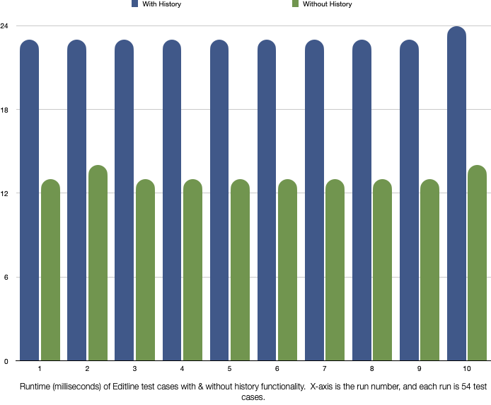

# Instrumenting unit tests with DTrace

This branch has a few changes to experiment with using DTrace to look at unit test performance.

* [Probe definitions](lldb/unittests/Editline/EditlineTest.d)
* [D program](lldb/unittests/Editline/EditlinePerf.d)
* [Instrumented unit test file](lldb/unittests/Editline/EditlineTest.cpp)

To run (assuming you are in a build tree that is a sibling of the source tree, that you've already run CMake, and that you're using the Ninja generator):

```
$ dtrace -arch x86_64 -h -s ../llvm-project/lldb/unittests/Editline/EditlineTest.d \
      -o ../llvm-project/lldb/unittests/Editline/EditlineTest.h
$ ninja EditlineTests && sudo dtrace -c tools/lldb/unittests/Editline/EditlineTests \
    -s ../llvm-project/lldb/unittests/Editline/EditlinePerf.d
```

I think there's more useful information to be gotten from the performance counters available through Instruments.  For instance, by looking at the number of cycles with outstanding L1 cache misses, it was clear that a great deal of time was spent in the EditlineAdapter destructor, which I traced to the command history loading/saving (from a file in the user's home directory).  Removing this from unit tests, which it isn't necessary for, gave a nice speedup (FYI, this perf comparison was done with tests in a pending patch that are not in the main tree):



I spent some time investigating how history was/wasn't used.  It is always enabled in Editline initialization, but can be turned off.  In fact, for unit tests, the slowdown with history can worsen over time, because the test cases read/write to the user's home directory, and that history file grows each time the test cases are run.

Machine/build info


| Property | Value |
|----------|-------|
| GIT commit for testing | Commit e874709ba4c4 (branch editline-test-keybindings-no-history) |
| Machine | 2017 iMac Pro w/ 2.3 GHz 18-Core Intel Xeon W |
| OS      | macOS 12.1 (21C52) |
| Storage | APPLE SSD AP4096M |


Build command line:

```
$ rm -rf * && cmake -G "Ninja" ../llvm-project/llvm -DLLDB_USE_SYSTEM_DEBUGSERVER=1 -DCMAKE_BUILD_TYPE=RelWithDebInfo -DLLVM_ENABLE_PROJECTS="clang;lldb;libcxx;libcxxabi" && ninja EditlineTests
```

Run command line:

```
$ for a in $(seq 1 10) ; do tools/lldb/unittests/Editline/EditlineTests | grep "54 tests from 2 test suites ran" | cut -f 9 -d " " | tr -d "(" ; done
```
